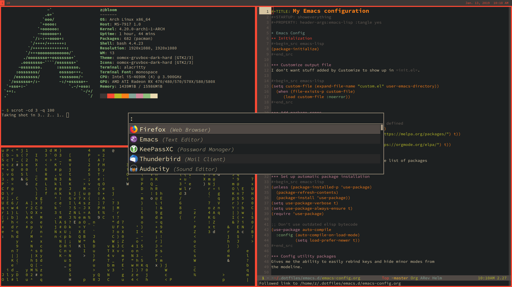

# dotfiles



My personal configuration files.

Powered by [Dotbot](https://github.com/anishathalye/dotbot).

## Usage

```bash
git clone --recurse-submodules https://github.com/bepzi/dotfiles.git ~/.dotfiles && \
cd ~/.dotfiles && \
git submodule update --init --recursive && \
./install
```

`install` can be run multiple times in a row without fear of breaking
anything. Any conflicts must be resolved manually, but Dotbot will
tell you what the symlinks are conflicting with.

See the Dotbot documentation for more options.
